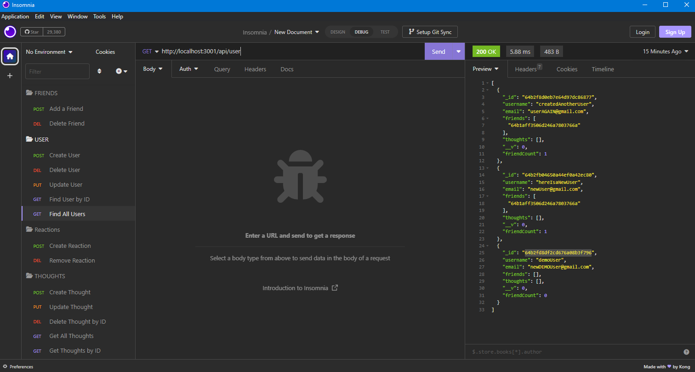

# NoSQL-Social-Network-API

## Technologies Used

## Table of Contents

\*[license](#license)

\*[title](#title)

\*[usage](#usage)

\*[walkthrough video](#walkthrough)

\*[screenshots](#screenshots)

\*[description](#description)

\*[installation](#installation)

\*[tests](#tests)

\*[github](#github)

## License

This project is licensed under the MIT license.
https://opensource.org/licenses/MIT

## Title
## NoSQL-Social-Network-API

## Usage

API for a social network web application where users can share their thoughts, react to friends’ thoughts, and create a friend list

## Walkthrough
https://watch.screencastify.com/v/MTUYJn0M0kAZT3bWKVYL

## Screenshots

## Description
API for a social network web application where users can share their thoughts, react to friends’ thoughts, and create a friend list

## Installation
Clone the repo, install the dependencies, and run `npm start` to start the server.  Navigate to `localhost:3001` in your browser to view the application.

## Tests
N/A
## GitHub
https://github.com/JerrickJohnson/NoSQL-Social-Network-API

https://github.com/JerrickJohnson